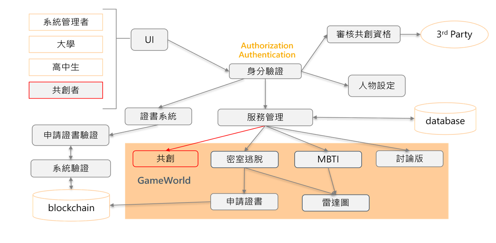

# U_U (大學科系探索共創平台 The exploration and collaboration platform of university department)

## 環境
- 開發工具
    - Unity
    - Nethereum
    - MySQL
- 測試環境
    - Windows

- 分工
    - 製作人數 : 4
    - 個人主要負責
        - Unity 及 MySQL之連接
        - Unity 及 Solidity之連接
        - 資料庫架構設計
        - 密室、共創模式之操作

## 簡介
因大學科系眾多，根據調查顯示，有大於50%的高中生對大學科系不夠了解，而現今的平台已文字敘述為主，難以讓高中生更認識科系，容易有認知上的落差，因此與團隊嘗試製作此平台，期望能讓高中生藉由遊戲認識科系。

## 主要功能
1. <b>密室遊戲體驗、共創模式</b> 
    藉由密室遊戲讓高中生可以認識科系，遊玩結果將可輸出至雷達分析圖做分數計算。共創模式可以讓曾於此科系畢業者或是在校學生、在職員工來共同創作，讓平台之體驗能夠更多元化。
    
2. <b>雷達分析圖</b> 
    此系統會抓取玩家於遊玩時的各種資訊，將資訊記錄下來後再根據全體玩家的遊玩表現作比較排名，最終為玩家計算出一個分數，而此分數可以反應出玩家在此科系上的表現情況，未來申請區塊鏈證書時也會一併附在證書內部。

3. <b>區塊鏈證書</b> 
    大學申請往往會需要繳交備審資料，因此藉由區塊鏈證書系統可以讓高中生在體驗完科系後可以獲得一張證書，而此證書存於鏈上，可以讓大學方到鏈上查詢學生之證書，藉此讓大學方也能夠確認學生確實曾來平台做過此科系之體驗，且藉由證書上之分數也能讓大學方知道該學生在此科系之表現情況如何。

## 系統架構圖
 

## 測試結果
1. 統計玩家遊玩資訊，分析後提供給高中生具參考價值之科系選擇
2. 將區塊鏈應用至證書發放與查驗系統，確保證書可以永久保存和系統的公正性

> 密室逃脫 : 玩家認識科系的方式 

>共創模式 : 共創者可於此空間內創作密室 

>雷達分析圖 : 幫助高中生了解自己適合的科系 

>討論區 : 玩家交流、分享心得 

>MBTI分析 : 傳統心理測驗，可幫玩家篩選出適合開始體驗的科系 

>證書 : 遊玩體驗證明，玩家可用於備審資料 

>證書驗證 : 大學端輸入證書編號，可認證玩家的證書是否是真的 

